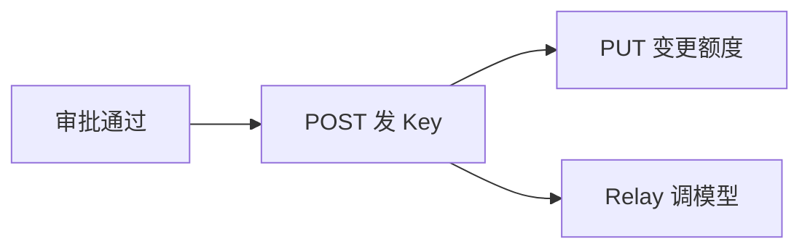
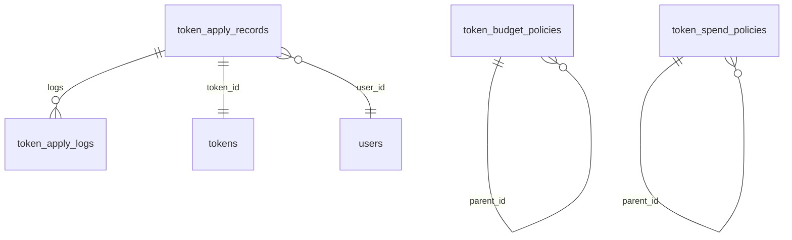
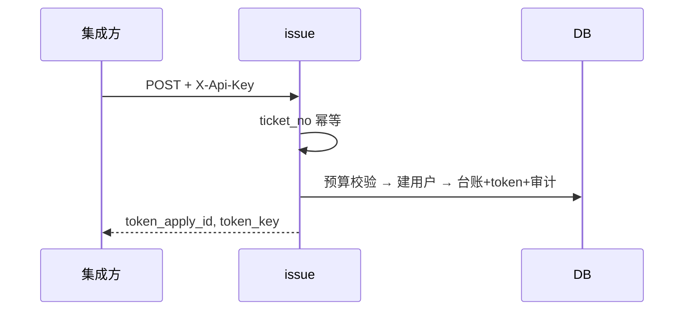
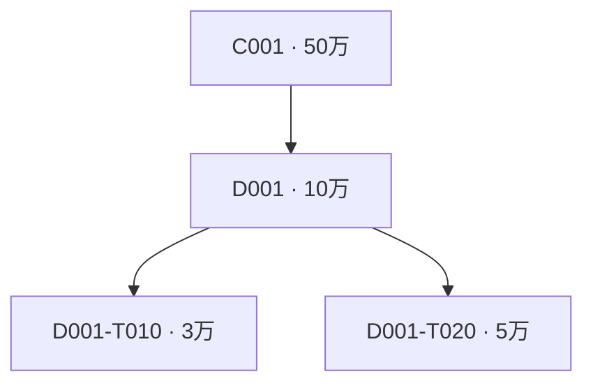
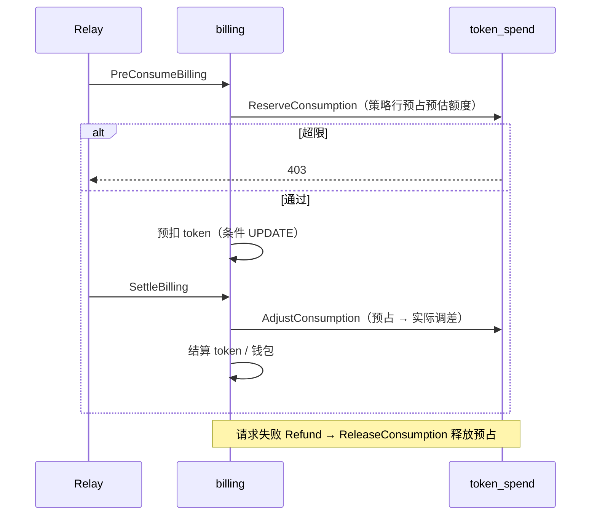
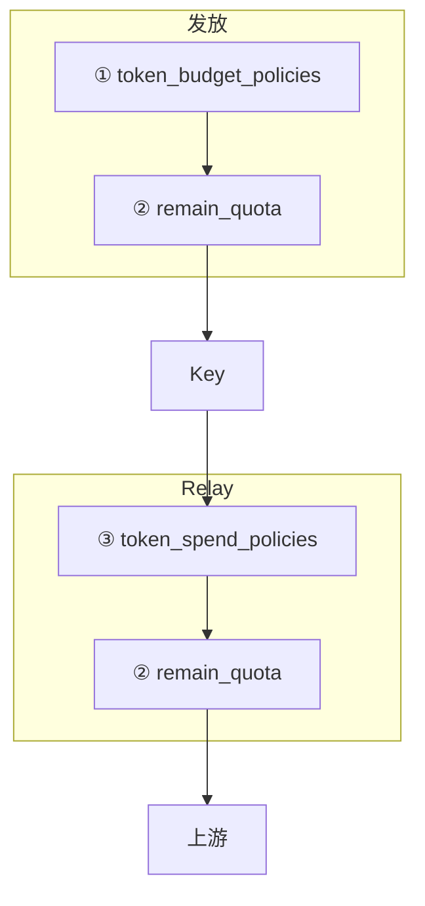

# 自动化令牌发放 · 设计文档

**一句话：** 审批在外部完成 → 集成方 API 发 Key → Relay 按三层限额扣费

- **模块：** `/api/token-apply`（与用户自助 `/api/token` 无关）
- **鉴权：** 集成方 `X-Api-Key`；模型调用 `sk-...`
- **对接文档：** [token-apply-api.md](../tests/token-apply/token-apply-api.md)（curl + 字段说明，发给第三方）
- **测试：** [token-apply-test.md](../tests/token-apply/token-apply-test.md) · [token-apply-api.md](../tests/token-apply/token-apply-api.md)

**实现进度**

- **P0**（发放 / 变更 / 审批预算 / 审计）— ✅
- **P1**（消耗日周月封顶 / 策略 API 推送）— ✅
- **P2**（外部消耗额同步、管理后台只读）— ⏸

---

## 目录

1. [概览](#1-概览) — 角色、主流程、三层额度说明
2. [数据表](#2-数据表) — 新增表职责与表间关系
3. [API](#3-api) — 发放、变更、策略接口与鉴权
4. [字段与库列](#4-字段与库列) — JSON 字段、库列与对账
5. [审批预算策略](#5-审批预算策略) — ① 审批上限如何匹配与校验
6. [集成对接](#6-集成对接) — 审批系统如何回调本模块
7. [实现](#7-实现) — 代码文件索引
8. [测试](#8-测试) — 测试文档与单测
9. [实现约束](#9-实现约束) — 设计与实现底线
10. [消耗封顶（P1）](#10-消耗封顶-p1) — ③ 消耗上限与 Relay 挂点
11. [限额与超额控制](#11-限额与超额控制) — 集成方配置指南（推送顺序、示例）

---

## 1. 概览

### 1.1 角色

- **集成方** — 审批通过后调 API；推送策略；保存 `token_apply_id` / `token_key`
- **管理员** — 只读查台账、策略、审计（后台待补）
- **new-api** — 验 Key → 校验限额 → 写台账 + 审计 → 发 Key
- **申请人** — 用 `token_key` 调 Relay

### 1.2 主流程



> **范围**  
> 站内钱包 `quota_applications` **不在**本文。限额怎么配 → 直接看 [§11](#11-限额与超额控制)。

### 1.3 三层额度（不可混用）

| 层 | 管什么 | 何时拦 | 存哪 |
|:--:|--------|--------|------|
| **① 审批** | 本周期还能**批**多少 | 发放 / 增额 | `token_budget_policies` + 审计 |
| **② Key** | 这把 Key 还能**花**多少 | 每次 Relay | `tokens.remain_quota` |
| **③ 消耗** | 组织/Key **实际已花**多少 | Relay 预扣前 | `token_spend_policies`（`used_amount` + `period_key` 行内计数） |

- 只配 **①** → 限继续发 Key，不限已发 Key 合计消费 → 须再配 **③**
- 不配 **③** → 组织日/周/月不限 → **② 总包（amount）仍限单 Key 总消费**
- `quota_mode=unlimited` → **仅**不计入 ① 审批预算；**② 总包仍按 amount 限制**

---

## 2. 数据表

- **`token_apply_records`**（新增）— 发放台账（当前额度、组织）
- **`token_apply_logs`**（新增）— 变更审计（只增不改）
- **`token_budget_policies`**（新增）— ① 审批上限配置（累计，无周期重置）
- **`token_spend_policies`**（新增）— ③ 消耗上限配置 + 本周期已用（`used_amount` / `period_key`）
- **`users` · `tokens` · `logs`**（已有）



**贯通样例：** 张三 / 平台组 `D001-T010` → 先发 3000 元，再扩到 5000 元。字段样例见 [§4](#4-字段与库列)（`token_apply_id=7`，`token_id=101`）。

---

## 3. API

> 路由在 `api-router.go` **顶层**注册，走 `ApiKeyAuth`（`TOKEN_API_KEY` 或 `token_apply_setting.api_key`），**不挂** `UserAuth`。

### 3.1 路由一览

**集成写接口**

| 方法 | 路径 | 说明 |
|:----:|------|------|
| `POST` | `/api/token-apply` | 首次发放（含总包/分包参数，自动同步 ①） |
| `PUT` | `/api/token-apply/:id` | 增额 / 减额（`:id` = `token_apply_id`） |

**消耗策略**（可选，③ 封顶；upsert 键：`(scope_type, scope_code, token_type)`）

| 方法 | 路径 | 说明 |
|:----:|------|------|
| `POST` | `/api/token-apply` | 发放（同步③消耗封顶字段） |
| `PUT` | `/api/token-apply/:id` | 变更（同步③消耗封顶字段） |

**只读查询**（登录用户，`UserAuth`）

| 方法 | 路径 | 说明 |
|:----:|------|------|
| `GET` | `/api/token-apply/records` | 台账列表 |
| `GET` | `/api/token-apply/records/:id` | 台账详情 + 审计日志 |
| `GET` | `/api/token-apply/budget` | ① 总包 + 已批/剩余（来自申请同步） |
| `GET` | `/api/token-apply/consumption` | ③ 消耗策略 |

### 3.2 鉴权

- **`X-Api-Key`** — 集成写接口（发放、变更；可选消耗策略）
- **`TOKEN_API_KEY`** — env 覆盖 `token_apply_setting.api_key`
- **`sk-...`** — 申请人调 `/v1/*`，与 `X-Api-Key` **不是**同一个

> **注意**  
> 未配置密钥 → 写接口一律 **401**。  
> 生成：`openssl rand -hex 32`

集成方 curl 前先设环境变量（下文示例均假定已 `export`）：

```bash
export BASE_URL="http://127.0.0.1:3000"
export TOKEN_API_KEY="<与 .env 或 token_apply_setting.api_key 一致>"
export TOKEN_APPLY_ID=7          # 发放响应中的 token_apply_id，变更时用
export TOKEN_KEY="sk-..."      # 发放响应中的 token_key，Relay 时用
```

### 3.3 发放 `POST /api/token-apply`

- **幂等** — 同 `ticket_no` → 返回原 `token_apply_id`、`token_key`；**不改**额度、**不增**审计
- **一流程一 Key** — 每个 `ticket_no` 只发放 **一个** 令牌
- **令牌名** — 可选 `token_name`；未传时默认使用 `ticket_no`
- **必填** — `ticket_no`、`email`、`org_code`；`user` 时加 `work_no`
- **金额** — 默认 `quota_mode=fixed`，`amount` 必填（**分包**，本笔 Key 额度）
- **总包（①）** — 可选 `org_budget`（部门审批总上限，自动 upsert `token_budget_policies`）；`project_budget` 在有 `project_code` 时设项目总包；`parent_org_code` + `parent_org_budget` 设上级总包
- **消耗封顶（③）** — 可选 `cap_amount` + `period_type`（默认 `month`），自动 upsert `token_spend_policies`
- **scope** — `scope_type` 默认 `team`
- **事务** — `users` + 台账 + `tokens` + 审计 + 总包同步 **同一事务**，失败全回滚

<details>
<summary><strong>curl 示例</strong></summary>

**员工令牌（`token_type=user`，必填 `work_no`）**

```bash
curl -sS -X POST "${BASE_URL}/api/token-apply" \
  -H "X-Api-Key: ${TOKEN_API_KEY}" \
  -H 'Content-Type: application/json' \
  -d '{
    "ticket_no": "WO-2025-001",
    "record_id": "rec_8a1b2c",
    "email": "zhang@corp.com",
    "amount": 3000,
    "currency": "CNY",
    "org_code": "D001-T010",
    "org_name": "平台组",
    "org_budget": 30000,
    "token_type": "user",
    "work_no": "E10086",
    "user_name": "张三",
    "remark": "新项目"
  }'
```

成功响应：

```json
{
  "success": true,
  "data": {
    "token_apply_id": 7,
    "user_id": 42,
    "token_id": 101,
    "token_key": "sk-..."
  }
}
```

**应用令牌（`token_type=app`，Key 归申请 `email`）**

```bash
curl -sS -X POST "${BASE_URL}/api/token-apply" \
  -H "X-Api-Key: ${TOKEN_API_KEY}" \
  -H 'Content-Type: application/json' \
  -d '{
    "ticket_no": "WO-2025-APP-01",
    "email": "owner@corp.com",
    "amount": 10000,
    "currency": "CNY",
    "org_code": "D001",
    "org_name": "企业信息部",
    "token_type": "app",
    "remark": "客服机器人"
  }'
```

**幂等重试（同 `ticket_no`，不改额度、不增审计）**

```bash
curl -sS -X POST "${BASE_URL}/api/token-apply" \
  -H "X-Api-Key: ${TOKEN_API_KEY}" \
  -H 'Content-Type: application/json' \
  -d '{
    "ticket_no": "WO-2025-001",
    "email": "zhang@corp.com",
    "amount": 3000,
    "org_code": "D001-T010",
    "token_type": "user",
    "work_no": "E10086"
  }'
```

**无 Api-Key → HTTP 401**

```bash
curl -sS -w "\nHTTP %{http_code}\n" -X POST "${BASE_URL}/api/token-apply" \
  -H 'Content-Type: application/json' \
  -d '{
    "ticket_no": "WO-2025-001",
    "email": "zhang@corp.com",
    "amount": 3000,
    "org_code": "D001-T010",
    "token_type": "user",
    "work_no": "E10086"
  }'
```

失败（审批超限）响应示例：

```json
{
  "success": false,
  "message": "预算不足：team D001-T010 累计已批 28000，本次 3000 将超出上限 30000"
}
```

</details>



### 3.4 变更 `PUT /api/token-apply/:id`

- **幂等** — `change_ticket_no` 已处理 → 原结果
- **增额** — 审批预算只计 **增量**；可选传 `org_budget` / `project_budget` 更新总包
- **减额** — 新 `remain_quota` ≥ `used_quota`，否则拒绝且**不写**审计
- **不可改** — `email`、`work_no`、`token_type`、首次 `ticket_no`
- **并发** — `FOR UPDATE` 锁台账 + `tokens`

**可选总包 / 消耗字段（增额时）** — `org_budget`、`project_budget`、`parent_org_code`、`parent_org_budget`、`cap_amount`、`period_type`、`scope_type`（语义同 §3.3 发放）

<details>
<summary><strong>curl 示例</strong></summary>

**扩容 3000 → 5000（`:id` = `token_apply_id`）**

```bash
curl -sS -X PUT "${BASE_URL}/api/token-apply/${TOKEN_APPLY_ID}" \
  -H "X-Api-Key: ${TOKEN_API_KEY}" \
  -H 'Content-Type: application/json' \
  -d '{
    "change_ticket_no": "WO-2025-001-CHG-1",
    "record_id": "rec_9d4e5f",
    "amount": 5000,
    "currency": "CNY",
    "remark": "项目扩容"
  }'
```

**减额（新额度低于 `used_quota` 时拒绝，不写审计）**

```bash
curl -sS -X PUT "${BASE_URL}/api/token-apply/${TOKEN_APPLY_ID}" \
  -H "X-Api-Key: ${TOKEN_API_KEY}" \
  -H 'Content-Type: application/json' \
  -d '{
    "change_ticket_no": "WO-2025-001-CHG-2",
    "amount": 2000,
    "currency": "CNY",
    "remark": "回收部分额度"
  }'
```

拒绝响应示例：

```json
{
  "success": false,
  "message": "减额后可用额度 1000000 低于已消耗 200000"
}
```

**变更幂等（同 `change_ticket_no` 返回原结果）**

```bash
curl -sS -X PUT "${BASE_URL}/api/token-apply/${TOKEN_APPLY_ID}" \
  -H "X-Api-Key: ${TOKEN_API_KEY}" \
  -H 'Content-Type: application/json' \
  -d '{
    "change_ticket_no": "WO-2025-001-CHG-1",
    "amount": 5000,
    "currency": "CNY",
    "remark": "项目扩容"
  }'
```

</details>

### 3.5 令牌类型

- **`user`**（默认）— Key 归属 `email` 对应用户
- **`app`** — Key 归属申请 `email` 对应用户

`user` / `app` 在策略里**分开统计**。

### 3.6 消耗封顶（③）

③ 消耗封顶策略随发放/变更请求字段同步写入 `token_spend_policies`（运维/集成方无需再调用独立策略写接口）。**① 审批总包不再单独推送**，随发放/变更请求中的 `org_budget` 等字段自动写入 `token_budget_policies`。

<details>
<summary><strong>总包 / 分包字段映射</strong></summary>

| 申请 JSON | 含义 | 写入 |
|-----------|------|------|
| `org_code` | 部门 | `token_apply_records.org_code` · `token_budget_policies.scope_code` |
| `org_budget` | 部门总包 | `token_budget_policies.total_amount` |
| `amount` | 本笔分包 | `token_apply_records.amount` · 审计 `budget_delta` |
| `project_code` + `project_budget` | 项目总包 | `token_budget_policies`（`scope_type=project`） |
| `parent_org_code` + `parent_org_budget` | 上级总包 | 父节点 `token_budget_policies` |

不传 `org_budget` 且库中无策略 → ① 不校验（与旧行为一致）。

</details>

<details>
<summary><strong>消耗封顶字段（随发放/变更同步）</strong></summary>

在 `POST /api/token-apply` 与 `PUT /api/token-apply/:id` 中可选携带：

- `cap_amount`：部门/团队本周期消耗封顶（元）
- `period_type`：`day` / `week` / `month` / `none`（默认 `month`）

写入（upsert 键）：`(scope_type, org_code, token_type)` → `token_spend_policies`。

</details>

---

## 4. 字段与库列

> 表头 **预算** = 参与 ① 策略匹配与已批汇总（≠ API 必填，必填见 §3.3）

<details>
<summary><strong>4.0 users · 4.1 token_apply_records · 4.2 tokens</strong></summary>

发放时 `org_code` → `tokens.group`（供 ③ 匹配）。

**token_apply_records（节选）**

| 说明 | 预算 | JSON | 样例 |
|------|:----:|------|------|
| 工单号 / 幂等 | | `ticket_no` | `WO-2025-001` |
| 本笔审批额（分包） | ✓ | `amount` | `3000` → `5000` |
| 部门总包（①） | ✓ | `org_budget` | `30000` → 自动 upsert `token_budget_policies.total_amount` |
| 项目总包 | ✓ | `project_budget` | 有 `project_code` 时 |
| 组织 | ✓ | `org_code` | `D001-T010` |
| 项目 | ✓ | `project_code` | `PRJ-E2E-01` |
| 类型 | ✓ | `token_type` | `user` |

**tokens（节选）**

| 说明 | 来源 | 样例 |
|------|------|------|
| `remain_quota` | `amount` 换算 | 随扩容变 |
| `group` | `org_code` | `D001-T010` |
| `used_quota` | Relay | 累计消耗 |

</details>

<details>
<summary><strong>4.3 token_apply_logs（审计）</strong></summary>

只增不改。对账：

- **台账当前审批额** — 最后一条 `amount_after`
- **组织累计已批** — `SUM(budget_delta)`（① 无周期重置，全历史累计）
- **Key 可用余额** — 审计 quota 轨迹 − `used_quota`
- **对外核对** — `change_ticket_no` / `record_id`

</details>

<details>
<summary><strong>4.4 token_budget_policies 字段</strong></summary>

| 库列 | 说明 | 来源 |
|------|------|------|
| `scope_type` | `company` / `org` / `team` / `project` | 申请 `scope_type`（默认 `team`）或项目维度 |
| `scope_code` | 精确匹配 | 申请 `org_code` 或 `project_code` |
| `total_amount` | 审批总上限（元，累计） | 申请 `org_budget` / `project_budget` / `parent_org_budget` |
| `parent_id` | 组织树 | 申请 `parent_org_code` 解析 |

唯一：`(scope_type, scope_code, token_type)`。**无独立写 API**；发放/增额时自动 upsert。已批多少不在本表，见审计 `budget_delta` 全量累计。

</details>

<details>
<summary><strong>4.5 token_spend_policies 字段</strong></summary>

| 库列 | 说明 | 来源 |
|------|------|------|
| `scope_type` | `company` / `org` / `team` / `project` / `token` | 申请 `scope_type`（默认 `team`）或 token 级 |
| `scope_code` | 精确匹配 | 申请 `org_code` 或 `token_id` |
| `cap_amount` | 周期消耗上限（元） | 申请 `cap_amount` |
| `period_type` | `day` / `week` / `month` / `none` | 申请 `period_type`（默认 `month`） |
| `used_amount` | 当前 `period_key` 内已消耗（元） | Relay Reserve/Adjust/Release |
| `period_key` | 当前周期键 | 同上；换期时 `used_amount` 归零 |
| `parent_id` | 组织树 | 申请 `parent_org_code` 解析 |

唯一：`(scope_type, scope_code, token_type)`。**无独立写 API**；发放/变更时随请求 upsert。

</details>

---

## 5. 审批预算策略

> 管 **① 还能批多少**。总包由发放/变更请求中的 `org_budget` 等字段 **自动 upsert** 到 `token_budget_policies`；分包计入审计 `budget_delta`。

### 5.1 匹配

- **`company` / `org` / `team`** — `org_code` = `scope_code`
- **`project`** — `project_code` = `scope_code`
- `token_type` 须一致
- 命中叶子后沿 `parent_id` **逐层**校验
- **不靠**编号前缀推断上级

### 5.2 组织树示例



`org_code=D001-T010`，申请 1.5 万，团队已批 2 万 → 2+1.5 > 3 万 → **拒绝**。

### 5.3 计入已批

- **首次发放** — 全额计入 `budget_delta`
- **增额** — 仅增量计入
- **减额** — **不计**入

---

## 6. 集成对接

**审批结果 → 动作**

- ✅ **通过** — `POST` 发 Key / `PUT` 变更额度
- ❌ **驳回** — **不调 API**

**工单字段 → JSON**

- 工单号 → `ticket_no` / `change_ticket_no`
- 用户 → `email` · `work_no`
- 组织 → `org_code` · `org_name`
- 部门总包 → `org_budget`（可选，同步 ①）
- 本笔额度 → `amount`（分包）

推荐：审批流 **HTTP 回调** → `/api/token-apply`（同 webhook，无需登录）。

<details>
<summary><strong>审批通过回调 curl 示例</strong></summary>

```bash
curl -sS -X POST "${BASE_URL}/api/token-apply" \
  -H "X-Api-Key: ${TOKEN_API_KEY}" \
  -H 'Content-Type: application/json' \
  -d '{
    "ticket_no": "WO-2025-001",
    "record_id": "rec_from_approval_system",
    "email": "zhang@corp.com",
    "amount": 3000,
    "currency": "CNY",
    "org_code": "D001-T010",
    "org_name": "平台组",
    "org_budget": 30000,
    "token_type": "user",
    "work_no": "E10086",
    "user_name": "张三",
    "remark": "审批流自动发放"
  }'
```

集成方保存响应中的 `token_apply_id`、`token_key` 供后续变更与对账。

</details>

---

## 7. 实现

- `model/token_apply.go` — 发放、变更、换算、Portal 只读（含 `IsTokenApplyToken` 等）
- `model/token_budget_policy.go` — 总包策略、校验、随申请 upsert
- `model/token_spend_policy.go` — 消耗策略、校验、周期用量（`used_amount`/`period_key`）
- `controller/token_apply.go` — HTTP（发放、变更、消耗策略、Portal）
- `service/token_spend_policies.go` · `billing.go` — ③ Relay 挂点
- `common/decimal.go` · `common/currency.go` · `common/period.go` — 金额精度、币种、周期 key
- `middleware/api_key_auth.go` — 通用 `X-Api-Key`

---

## 8. 测试

- **测试计划（待评审）：** [token-apply-test.md](../tests/token-apply/token-apply-test.md) — 含金钱用例 M-01~M-43、执行记录表
- **集成 curl 示例：** [token-apply-api.md](../tests/token-apply/token-apply-api.md)

评审通过后按测试计划手工执行（curl + psql + 浏览器），结果填入 `token-apply-test.md` §12。

---

## 9. 实现约束

1. 预算 / 消耗校验：`scope_code` 精确匹配；上级靠 `parent_id`
2. 币种换算、周期起算各一个函数（`AmountToQuota` / `common.PeriodKey`）
3. 新统计维度加列即可，不改 `ticket_no` / `token_apply_id` 主流程
4. 子策略上限之和 ≤ 父策略（入库校验）
5. 台账 / 策略由集成 API 写入；管理后台**只读**待补
6. 发放 / 变更同事务：行锁 → 审计 + 台账 + Key 一并提交或回滚

---

## 10. 消耗封顶（P1）

> 管 **③ 实际花了多少**。与 §5 **独立表、独立计数**。

- **组织封顶** — `org_code` 日/周/月累计 ≤ `cap_amount`
- **Key 封顶** — `scope_type=token` 命中后**覆盖**组织链
- **`none` / 未配** — 跳过该层（仍受 ② 约束）
- **硬拦** — 预扣前超 cap → **403**，不调上游

### 10.1 表结构（节选）

**token_spend_policies** — `cap_amount`、`period_type`、`used_amount`、`period_key` 同行存储；`scope_type=token` 时按 Key 封顶。

| 库列 | 说明 |
|------|------|
| `used_amount` | 当前 `period_key` 内已消耗（**元**） |
| `period_key` | `2025-06-13` / `2025-W24` / `2025-06`；换期比较失败则 `used_amount` 从 0 重计 |

### 10.2 Relay 流程



- **Reserve** — 预扣前在 `token_spend_policies` 上占位（预估 quota），`FOR UPDATE` 写入  
- **Adjust** — 结算时按 `actual - reserved` 调差；先于 token 扣费，失败则回滚  
- **Release** — 上游失败退款时释放预占  
- token-apply Key：**只扣 `tokens`**，不扣 `users.quota`

### 10.3 不做 / 可选

- Key 继承消耗模板 — ❌ 不做；用 `scope_type=token`
- 审批总包写 API — ❌ 已移除；随 `org_budget` 等申请字段自动 upsert（§3.3）
- 消耗封顶策略随发放/变更请求同步写入（无独立写 API）
- logs 实时 SUM — 可选对账，非热路径
- P2 外部消耗同步 — ⏸

---

## 11. 限额与超额控制

> **集成方必读。** 发放时带 `org_budget`（总包）+ `amount`（分包）→ 发 Key → Relay 自动校验 ③（若已配消耗策略）。

### 11.1 三层关系



### 11.2 两表对比

| | ① `token_budget_policies` | ③ `token_spend_policies` |
|--|---------------------|---------------------------|
| 上限 | `total_amount`（来自 `org_budget`） | `cap_amount` |
| 已用 | 审计 `budget_delta`（全历史累计） | 行内 `used_amount`（当前 `period_key`） |
| 触发 | 发放 / 增额 | Relay 预扣 + 结算 |
| `none` | — | 跳过该层封顶 |

### 11.3 周期（仅 ③）

| `period_type` | ③ `period_key` 示例 |
|-----------------------|---------------------|
| `day` | `2025-06-13` |
| `week` | `2025-W24` |
| `month` | `2025-06` |
| `none` | 不封顶 |

> ① 审批预算**无周期重置**，`budget_delta` 全历史累计与 `total_amount` 比较。

### 11.4 超额公式

```text
①  累计已批 + 本次  >  total_amount     →  拒绝发放/增额
②  remain_quota  <  本次 quota            →  403
③  used + 本次(元)  >  cap_amount         →  403
```

### 11.5 推荐对接顺序

**1. 发放 Key（总包 + 分包一次提交）**

```bash
curl -sS -X POST "${BASE_URL}/api/token-apply" \
  -H "X-Api-Key: ${TOKEN_API_KEY}" \
  -H 'Content-Type: application/json' \
  -d '{
    "ticket_no": "WO-2025-001",
    "email": "zhang@corp.com",
    "amount": 3000,
    "currency": "CNY",
    "org_code": "D001-T010",
    "org_name": "平台组",
    "org_budget": 30000,
    "parent_org_code": "D001",
    "parent_org_budget": 100000,
    "token_type": "user",
    "work_no": "E10086"
  }'
```

**2. 发放 Key（可选同步消耗封顶）**

```bash
curl -sS -X POST "${BASE_URL}/api/token-apply" \
  -H "X-Api-Key: ${TOKEN_API_KEY}" \
  -H 'Content-Type: application/json' \
  -d '{
    "ticket_no": "WO-2025-001",
    "email": "zhang@corp.com",
    "amount": 3000,
    "currency": "CNY",
    "org_code": "D001-T010",
    "org_name": "平台组",
    "cap_amount": 500,
    "period_type": "day",
    "token_type": "user",
    "work_no": "E10086",
    "user_name": "张三"
  }'
```

**3. 用户调 Relay（`Authorization: Bearer`，非 Api-Key）**

```bash
curl -sS -X POST "${BASE_URL}/v1/chat/completions" \
  -H "Authorization: Bearer ${TOKEN_KEY}" \
  -H 'Content-Type: application/json' \
  -d '{
    "model": "gpt-4o-mini",
    "messages": [{"role": "user", "content": "hello"}]
  }'
```

### 11.6 配置示例

<details>
<summary><strong>A · 团队月批 3 万 + 月消耗 3 万（单层，无 parent）</strong></summary>

```bash
curl -sS -X POST "${BASE_URL}/api/token-apply" \
  -H "X-Api-Key: ${TOKEN_API_KEY}" \
  -H 'Content-Type: application/json' \
  -d '{
    "ticket_no": "WO-2025-001",
    "email": "zhang@corp.com",
    "amount": 3000,
    "currency": "CNY",
    "org_code": "D001-T010",
    "org_budget": 30000,
    "cap_amount": 30000,
    "period_type": "month",
    "token_type": "user",
    "work_no": "E10086"
  }'
```

</details>

<details>
<summary><strong>B · 部门月批 10 万 + 团队日消耗 500</strong></summary>

```bash
# 1. 发放（同步父/子总包 + 本笔分包）
curl -sS -X POST "${BASE_URL}/api/token-apply" \
  -H "X-Api-Key: ${TOKEN_API_KEY}" \
  -H 'Content-Type: application/json' \
  -d '{
    "ticket_no": "WO-2025-001",
    "email": "zhang@corp.com",
    "amount": 3000,
    "currency": "CNY",
    "org_code": "D001-T010",
    "org_budget": 30000,
    "cap_amount": 500,
    "period_type": "day",
    "parent_org_code": "D001",
    "parent_org_budget": 100000,
    "token_type": "user",
    "work_no": "E10086"
  }'
```

</details>

<details>
<summary><strong>C · 单 Key 日限额 100 元</strong></summary>

单 Key（`scope_type=token`）消耗策略不再通过对外 API 写入；如确需该能力，建议由内部管理工具/数据库维护。

</details>

<details>
<summary><strong>D · 门户只读（登录 Session，非 Api-Key）</strong></summary>

浏览器登录后复制 Cookie，或使用 `-b` 传入 session：

```bash
export SESSION_COOKIE="<浏览器 session cookie 值>"

curl -sS -G "${BASE_URL}/api/token-apply/records" \
  -H "Cookie: session=${SESSION_COOKIE}" \
  --data-urlencode "page=1" \
  --data-urlencode "page_size=20"

curl -sS "${BASE_URL}/api/token-apply/records/${TOKEN_APPLY_ID}" \
  -H "Cookie: session=${SESSION_COOKIE}"

curl -sS -G "${BASE_URL}/api/token-apply/budget" \
  -H "Cookie: session=${SESSION_COOKIE}" \
  --data-urlencode "scope_type=team" \
  --data-urlencode "scope_code=D001-T010"

curl -sS -G "${BASE_URL}/api/token-apply/consumption" \
  -H "Cookie: session=${SESSION_COOKIE}" \
  --data-urlencode "scope_type=team" \
  --data-urlencode "scope_code=D001-T010"
```

普通用户仅见本部门（`users.group` 匹配）；管理员见全部。

</details>

### 11.7 选型速查

- **还能批多少** → ①，总包随 `org_budget` 同步；已批见审计 `budget_delta`
- **单 Key 总消费** → 发 Key 时 `amount`（②）
- **组织日/周/月实际消耗** → ③ + `day`/`week`/`month`
- **某层消耗不限** → 不配 ③ 或 `period_type=none`
- **多层都卡** → 各层一行 + `parent_scope_*`
- **单 Key 特殊限额** → ③ `scope_type=token`

### 11.8 边界

- **未配策略** — 该层不限制
- **只有 org 策略、申请用 team 编号** — 可能匹配不到
- **`quota_mode=unlimited`** — 不计入 ① 已批；**② 总包仍按 amount 封顶**
- **token-apply Key** — Relay **只扣 Key**，不扣 `users.quota`
- **信任旁路** — token-apply 或配了 ③ 时**强制预扣 token**；不再跳过
- **免费模型** — 不预扣钱包/Key，但若配 ③ 仍 **Reserve**；失败会 Release
- **结算失败** — 写 SysLog 告警；`used_amount` 调差失败会阻断扣费；Settle 失败会回滚

---

*文档版本：P0 + P1 已实现 · ① 总包随发放/变更参数同步；③ 消耗策略可选 API*
